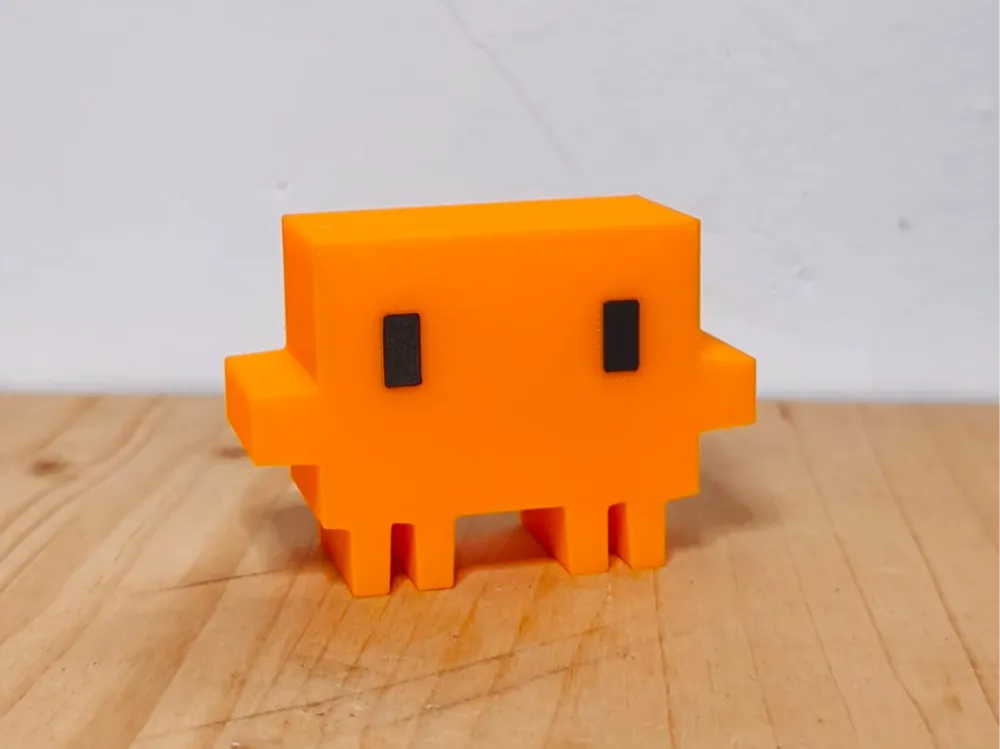

## Introduction
 
In modern education, AI is generally frowned upon with few exceptions. Turning in work that you did not do yourself, surely that is a breach of academic integrity, right? While that may be true for many fields, Software Engineering is one of those exceptions. I look at code as a tool to solve a problem, not an art project or a means of expression. In the professional world, manually typing 1,000 lines of code when an AI could have done it in a minute with fewer bugs is inefficient. I started ICS 314 trying to code manually, but as the semester got busier, I swapped my "ego" for efficiency. I moved to Claude Code because I realized that the results have deadlines, the material to be learned does not.

## Personal Experience with AI

I started off trying to learn the material purely by hand, but when my grades were on the line and the clock was ticking, I pivoted. You can learn syntax anytime, but you only get one shot at your final grade. Here are all of the course elements, and my degree of AI usage (Claude Code):

1. Experience WODs: Rarely used AI, only when I had tough problems such as Prisma errors that seemed to persist no matter what I tried. AI was very useful at finding these errors and solved them quickly.

2. In-class Practice WODs: Did not use AI except for the Prisma error I was experiencing in the NextJS WODs.

3. In-class WODs: Started off trying to not use AI, but started using Claude Code in the last few WODs to stay under the time limit. I would have the AI implement large parts of the assignment, as I could learn the material and be able to do it on my own later if needed. I did not want to sacrifice my grade, so these are what caused me to begin to use AI in coding. AI was very useful in this case and I had no problems.

4. Essays: Used to reference the structure of my essay and correct grammar, not used to write for me.

5. Final project: Used AI for many of the issue implementations. I did not have much time to work on the project, and there was a lot to be done. I used AI as it was faster, more accurate, and better at detecting security issues within my webapp. By allowing AI to write the code for me, I could focus on authorization, features, and a user management system that could work within our constraints.

6. Learning a concept / tutorial: Used AI occasionally to understand certain concepts within PostgreSQL, Prisma, and Vercel. It was able to explain these well.

7. Answering a question in class or in Discord: I did not do this.

8. Asking or answering a smart-question: I did not do this.

9. Coding example: I did not do this.

10. Explaining code: I used AI for this within the final project, so I could get a better idea of the code that my team members had written.

11. Writing code: I used AI for this often within the in-class WODs and final project. I was able to create an initial version of my code using AI, then tweak it to suit my needs.

12. Documenting code: I did not use AI for the purpose of documenting code, however when Claude writes code, it leaves comments which I found helpful.

13. Quality assurance: I used AI here in the final project to make sure it complied with ESLint and Playwright. If the checks came back as unsuccessful, I had Claude Code pinpoint the error and make changes to resolve the issue.

14. Other uses in ICS 314 not listed: None.

## Impact on Learning and Understanding

My memory of syntax is not great, especially this semester where many new languages and concepts are introduced. Because of AI, I was able to write using the syntax I had somewhat memorized, and Claude would fill in the blanks. I understood the logic, though I let the AI handle the semicolons. While I may not have learned how to flawlessly type a function on paper, I don't see much of an issue with this. I find it similar to being able to do long division: there are not many real-life scenarios where you wouldn't have access to a calculator. Regarding software engineering concepts, AI had enhanced my learning, as I was able to understand difficult parts that I did not understand; it was like having a private tutor. My main usage of this was PostgreSQL, where the exercises listed in the documentation assumed you had a Linux operating system. I used AI to bridge the gap to make it work on my Windows laptop.

## Practical Applications

I haven't used this for outside projects yet, but it changed how I think about coding. If an employer sees a developer wasting hours on something an AI can do in seconds, it isn't dedication, it's inefficiency. Using AI in this class felt like a trial run for how the real world may actually operate.

## Challenges and Opportunities

I actually did not have a single notable issue with AI. I was using Claude Code, which was known for its reliability in coding. I was able to add features to my final project that I did not initially believe to be possible within the time constraints, and I believe I can continue to add more features easily if needed. In more complex and novel tasks, I can see how AI would struggle.

## Comparative Analysis

To me, the difference between traditional coding and AI-enhanced coding is like the difference between doing long division on paper versus using a calculator.

Knowing how to do the math by hand is a good foundational skill, and it's how most of us start. But once you're in a high-stakes environment where the goal is to build a bridge or manage a budget, you're going to use the calculator every time. It's faster and it hardly makes errors. In software engineering, traditional methods help you understand concepts, but AI-enhanced methods are what get you results without confusion due to a missing bracket or a syntax error.

## Future Considerations

As AI gets better at handling the manual labor of coding, software engineers will spend less time typing and more time auditing. We’ll be the ones checking the AI’s work for errors and bugs. While I don't know what effect AI will have on the current job market, I do believe that software engineers are still needed and cannot be replaced. At most, the job responsibilities will change from writer to reviewer.

## Conclusion

Coming into ICS 314, I had the mindset that using AI was cutting corners. Over the semester, my perspective shifted, because the context matters. In a course with tight deadlines and a lot of new material, it became a practical tool rather than a crutch. AI is not a replacement for understanding. It filled in my syntax gaps, but the logic still had to come from me. I still had to know what I was building, why it needed to work a certain way, and whether the output was actually correct. The moments where I struggled through problems manually early in the semester made the later AI-assisted work more meaningful, because I had something to compare it to. For me, in this course, AI helped more than it hurt. Going forward, I think the more useful question isn't "should I use AI?" but "do I actually understand what it's doing for me?" That distinction is probably what separates using it well from depending on it blindly.
