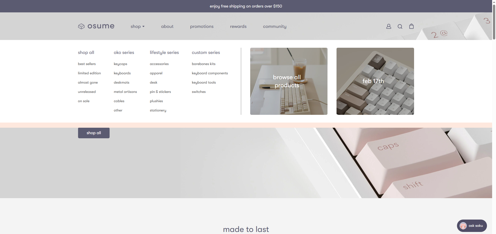

## What are UI frameworks?

UI frameworks are collections of components, used for building websites and applications. Think of it as a box of art supplies, with the website as your canvas. UI frameworks give us a variety of tools to create unique designs, rather than just using HTML and CSS. By using HTML and CSS, you are essentially limiting yourself to just a pencil; while you can create something beautiful with a pencil, it would lack color and depth, and there is little downside in expanding your selection of tools.

## How do UI frameworks keep my website looking fresh?

If everyone were to exclusively use HTML and CSS, you would quickly start to notice that the internet looks very bleak. These two languages are very barebones when it comes to design, and things would start to lack individuality. By incorporating a UI framework such as Bootstrap 5, we are presented with many more options and variety. Instead of limiting yourself to a single color, you are able to use 100. Combine that with the countless other UI frameworks, and you have an infinite number of colors at the palm of your hand. While you can manually input these components and create something unique with just CSS and HTML, it would take much longer and discourage more people from creating a unique website.

## An example using Tailwind CSS

One of my favorite usages of UI frameworks is on [this website](https://osume.com/) that sells keyboards and keycaps. Creating an aesthetic with a design like this would be difficult in HTML and CSS as this site relies on icons and navbars. Below is an example screenshot of how the site may look on the home page after clicking the dropdown next to "shop".

.
