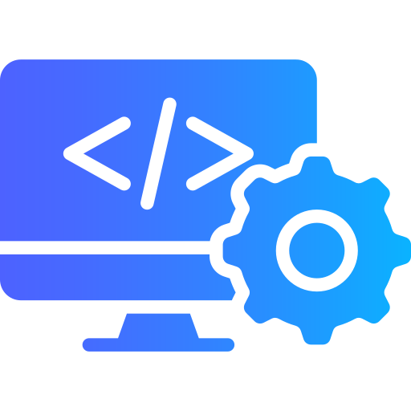

## Introduction

When I started this class, I thought it was going to be mostly about web development. Though it did largely focus on that, the concepts we covered go well beyond building websites. Two topics in particular stuck with me: Agile Project Management and Ethics in Software Engineering. Both came up in hands-on ways during the course, and I think they apply broadly to software work in general.

## Agile Project Management

Software projects fail all the time. They go over budget, miss deadlines, or ship something that does not match what users actually needed. One common reason is that teams try to plan everything at the start before writing any code. By the time the product is finished, the original plan is often outdated.

Agile Project Management is meant to address this. Rather than planning the whole project upfront, teams work in short cycles called *iterations*. Each iteration produces a working piece of the software. The team reviews it, gets feedback, and adjusts before starting the next cycle. This keeps the project responsive to change instead of locked into early assumptions.

A more specific approach within Agile is called **Issue Driven Project Management (IDPM)**. In IDPM, all work is broken into *issues*, each describing a specific task, who is responsible for it, and how long it should take. Issues are grouped into *milestones*, which represent the iterations of the project.

My team used this in our final group project. There were four of us building a website where users could create, share, and browse email templates. We split the work across three milestones (M1, M2, M3) using GitHub Projects, with around ten issues each. Every issue had a time estimate and was assigned to one person. When something was done, the issue got closed and we moved on.

It worked well. Having everything tracked as issues meant nothing was vague or forgotten. If someone was stuck, it showed up in the board. I have done group projects without this kind of structure before, and the difference is real. Work gets lost, effort gets duplicated, and it is hard to tell what anyone else is doing.

I do not think IDPM is specific to web apps. Any team project, whether it is embedded software, a data pipeline, or a mobile app, could benefit from the same structure. If more than one person is working on something over multiple weeks, tracking issues this way makes coordination a lot simpler.

## Ethics in Software Engineering

Ethics does not come up in most ICS courses, but it matters in software engineering because the software we build affects real people. The Association for Computing Machinery (ACM) publishes a Code of Ethics for software engineers. The main idea is that engineers should act in the public interest, be honest, and avoid causing harm.

In this class, we put those principles to work in an in-class debate. The scenario was a fictional company called WatchMe Inc. and their product, the *GetFace System*, a facial recognition tool being sold to law enforcement. Half the class had to argue it was ethical to work on it, and the other half had to argue it was not. We had to back up our positions using the ACM Code of Ethics.

The problems with GetFace were pretty clear. The system trained on people's faces without their consent. People had no way to access or remove their data. There was no dedicated security team protecting it. And results were shared with law enforcement without anyone being told. Each of these violates specific ACM principles around consent, privacy, security, and transparency.

The debate was useful not because the scenario was real, but because it made the ethical reasoning concrete. The engineers at WatchMe were not necessarily bad people. They just built something without thinking through who it would be used on, what would happen when it got things wrong, or who would be hurt by those mistakes. That kind of thinking needs to happen before the software is built, not after something goes wrong.

This is not a web development concern specifically. Credit scoring algorithms, medical tools, hiring software, etc. All of these have consequences for real people. The ACM Code of Ethics exists because engineers in those areas need a framework for thinking through those consequences, and "I was just doing my job" is not a sufficient answer.

## Conclusion

This course was about web development on the surface, but the more lasting takeaways were about how to work and how to think. IDPM gave me a concrete way to organize collaborative projects that I can see using again. The ethics debate gave me a framework for thinking about the effect software has on the world, not just about building. Those feel like skills that will matter regardless of what I end up doing in the future.

