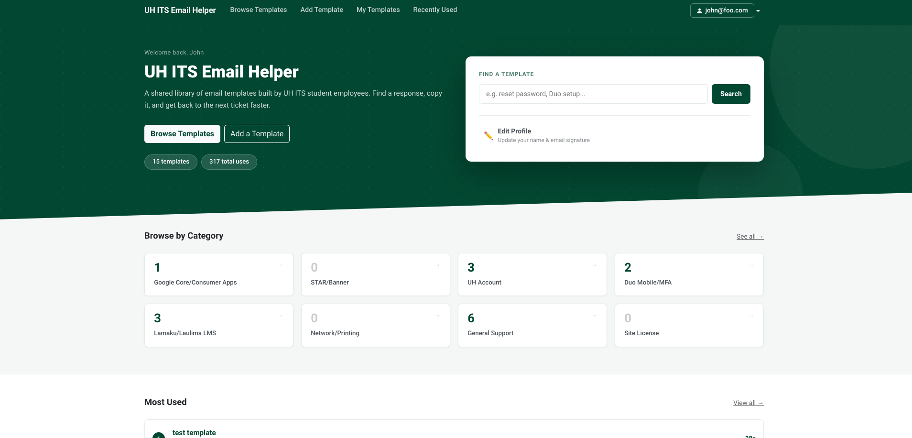

## Overview

UH ITS Help Desk student employees respond to a high volume of emails every day. Drafting professional responses from scratch each time is slow and inconsistent. The UH ITS Email Helper is a shared database of email templates built specifically for these student workers. Users can create, browse, and copy templates organized by category and tags, with automatic signature insertion when copying. The website also includes a commenting system, usage tracking, and an admin dashboard for managing users and templates.

## My Contributions

I worked in a team of four using Issue Driven Project Management across three milestones. My main contributions focused on authorization and user management. I implemented the account registration system using a master code for whitelisting, and built out the admin dashboard functionality that allows admins to manage users and templates. I also worked on several template-related features such as tags, search, and categories. I had also populated the website with real templates that were used within TDX, and received feedback from several of the student employees currently working at UH ITS.

## What I Learned

This project was my first time building a web application as part of a team. Working with Next.js, PostgreSQL, and Prisma together gave me a much better sense of how the frontend, backend, and database interact in a real project. I also learned how quickly scope can grow once a working foundation is in place. Features that seemed like stretch goals at the start of M1 were achievable by M3 because we tracked our effort and knew how much capacity we had left. Managing authorization and user roles also taught me how much planning goes into something that users never directly see.

- Project website: <a href="https://ics314-group-4.github.io/">ics314-group-4.github.io</a>
- Deployed app: <a href="https://uh-its-email-helper.vercel.app/">uh-its-email-helper.vercel.app</a>
- Source: <a href="https://github.com/ICS314-Group-4/Group-4-Final-Project"><i class="large github icon"></i>ICS314-Group-4/Group-4-Final-Project</a>
