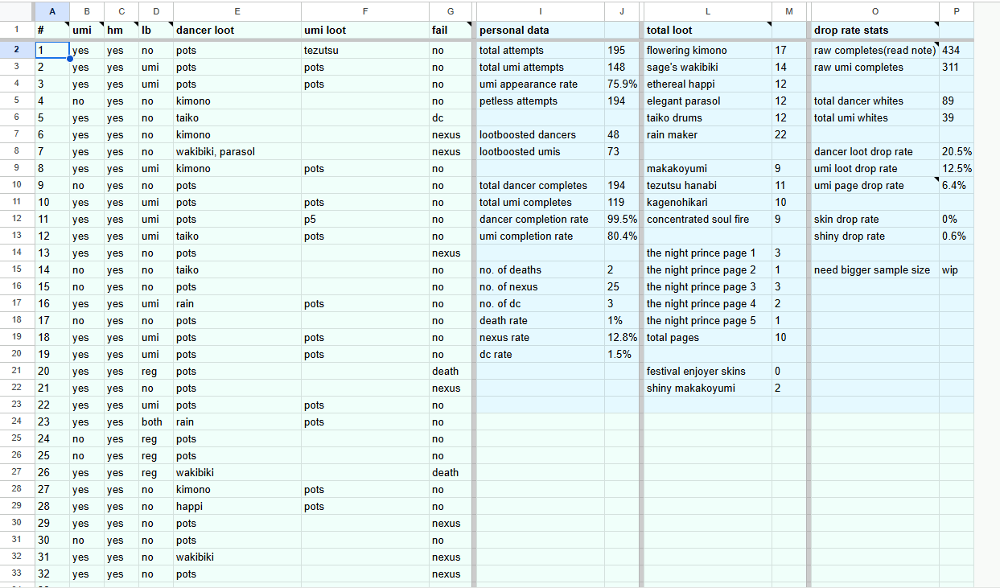

During my free time, I enjoy playing MMORPG games such as Path of Exile and Realm of the Mad God. During a new update or content release, I would typically analyze the specific rates of events occurring within the game and publish the data for the public to see. Since almost all games do not disclose these rates, I dedicate a lot of my time to collecting a large sample size enough to get an adequate estimate. When creating the spreadsheet, I have to account for many variables and incorporate them into creating a formula that gets a raw estimate of the probability of a specific event.

This project was done alone; however, I often collaborate with others to increase the sample size and get a much better estimate of the specific rates. If a sample takes a long time to collect or a specific event has a low probability, I consult others since these have high variance. For example, if a sample takes 2 hours to collect and has a specific event with a 0.5% chance of occurring, it would require collaboration to achieve a low margin of error.

During this project, I learned to use spreadsheets effectively, demonstrate knowledge of probability and statistics, and organize and analyze data. I also learned to create various functions within my spreadsheet to create a section for analyzing the samples. [Here](https://docs.google.com/spreadsheets/d/1_Hdiy39Fg39gPZJjOvPes3k4wOt-v48H9suKQPep8GU/edit?usp=sharing) is a link to one of my spreadsheets that I had started right after a major rework of the probabilities of certain events occurring. Although it is still a work-in-progress, the sample size is fairly large and can assist others in getting an objective estimate of certain probabilities without having to invest hundreds of hours into collecting their own data. 

